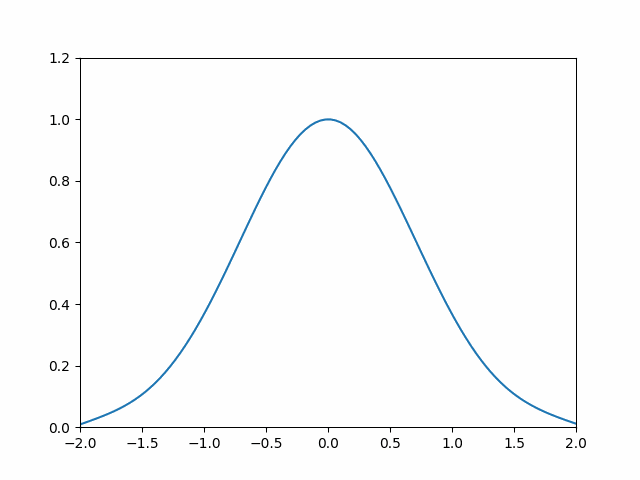

# Solving_pdes_with_pinns
 
We use Physics Informed Neural Networks (PINNs) to solve some basic example PDEs such as the logistic equation and the heat equation. We use [sciann](https://www.sciann.com/) wichs is based on tensorflow and keras to build and train our models.

* In myFirstEquation we solve the logistic equation for a fixed initial value

* In logisticEquation_initialValue we solve again the logistic equation but for every initial value in the interval [0,2]. 

* In heat_equation we solve, you guessed it, the heat equation. First in one spatial variable and then in two. We get the solution for a specific gaussian-like initital condition and plot it.

